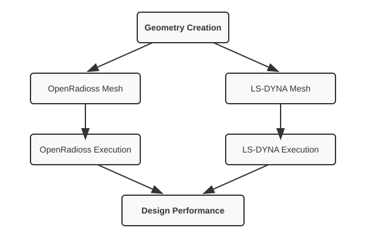

A graph of actions
==================
All the steps in a simulation are encapsulated in actions.
The basic action types can be a change to an input deck, running an OpenFOAM analysis, or
extracting results from an analysis.

Some actions are used for control e.g. to set up the simulation as a graph where some actions depend on other actions.

The diagram below illustrates a workflow where a single geometry creation step leads to two parallel analysis branches: one for OpenRadioss and another for LS-DYNA. Each branch includes meshing and parameterization steps, and finally, the results from both solvers are combined to compute the overall design performance.

Using an action
---------------
An action defines an operation in the workflow.
It can be anything from a geometry creation, an FEA analysis, 
to mathematical computations.
Once you have an action defined, you can call the 'solve()' method
to execute.

The return value of the 'solve()' method depends on the action; for example,
for a d3plot database extraction it may return the extracted data
as a numpy array.

You can call the 'solve()' method on a garaph. In which case it will return a dictionary
containing the names and return values of all the children;
e.g. ``{'child_A': array([2, 1, 2]), 'child_B': 3.1}``.

.. code-block:: python

        from simnexus.dyna_actions import DynaAnalysis
        dyna = DynaAnalysis(name="RunSpring", input_path="spring.k")
        ret = dyna.solve( {'K': 100.} )

You can chain actions to edit a mesh or extract results as described below.

Defining a user action
-------------------------
You can create your own action by subclassing WorkAction
and defining the action in the 'solve()' method.
The optional ``description`` argument documents what the action returns.
If omitted, the class docstring is used.

.. code-block:: python

    from simnexus.actions import WorkAction

    class AdderAction(WorkAction):
        """Adds two numbers and returns the sum."""
        def solve(self, val_dict=None):
            a = val_dict.get('a', 0)
            b = val_dict.get('b', 0)
            return a + b

    # With an explicit description:
    adder = AdderAction(name='add', description='Sum of inputs a and b')

Setting up a graph
------------------
Two types of graphs are available:
firstly, a WorkFlow, a simple version executing the actions sequentially;
and a DirectedGraph, which allows execution to branch and execute
actions in parallel.

To use a WorkFlow to evaluate actions sequentially:

.. code-block:: python

    from simnexus.dyna_actions import DynaAnalysis
    from simnexus.graph_actions import WorkFlow

    wf = WorkFlow(name="SpringWorkFlow")
    wf.add_action( DynaAnalysis(name="RunSpring", input_path="spring.k") )
    d3p = d3plot_File( name='field' )
    d3p.NodalValue(name='n5', state=1, nid=5, component= 'node_displacement'  )
    wf.add_action( d3p )

    ret = wf.solve( {'K': 100.} )

    print( 'Displacement of node 5', ret['n5'] ) 

To use a DirectedGraph:

.. code-block:: python

    # FINISH TEST : ADD AS EXAMPLE
    from simnexus.dyna_actions import DynaAnalysis
    from simnexus.graph_actions import DirectedGraph

    dg = DirectedGraph( name='MDO' )

    # OpenRadioss branch
    rr = dg.add_action( RadiossAnalysis( name='rad',
                                    cmd='radioss_using_dyna_inp',
                                    create_d3plot=True ) )

    # LS-DYNA branch
    rs = dg.add_action( DynaAnalysis(name="RunSpring", input_path="spring.k") )

    d3p = d3plot_File( name='field' )
    d3p.NodalValue(name='n5', state=1, nid=5, component= 'node_displacement'  )
    dg.add_action( d3p, parents= [rs] )

    # Merge back
    dg.add_action( tail_a, parents=[rr, d3p ] )

